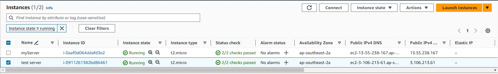
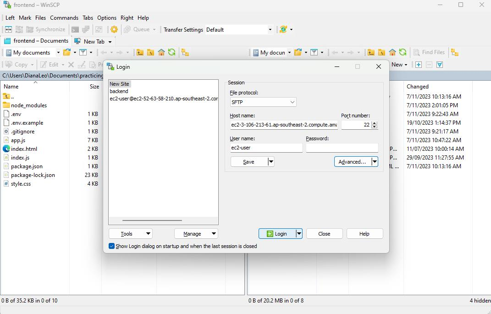
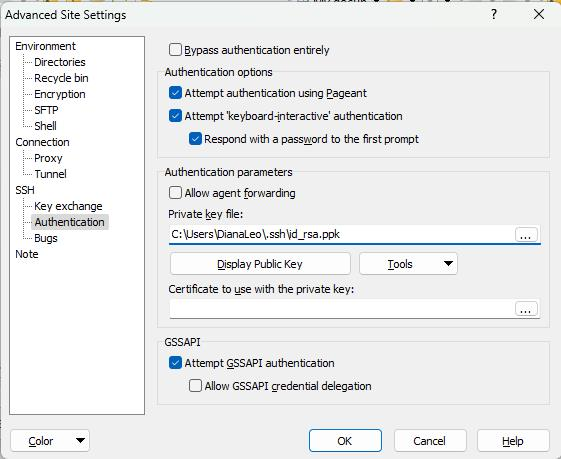
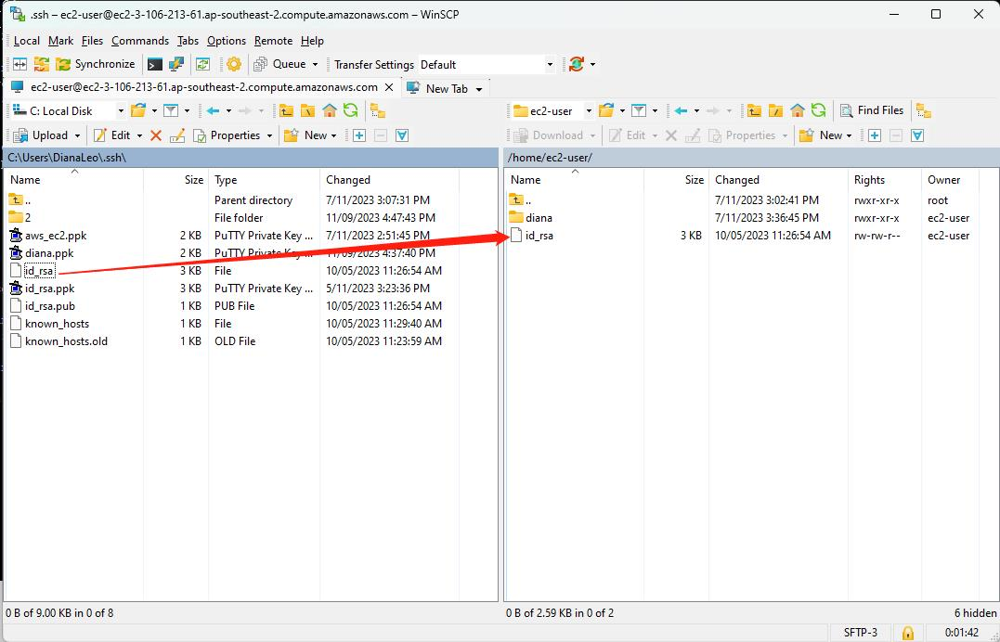
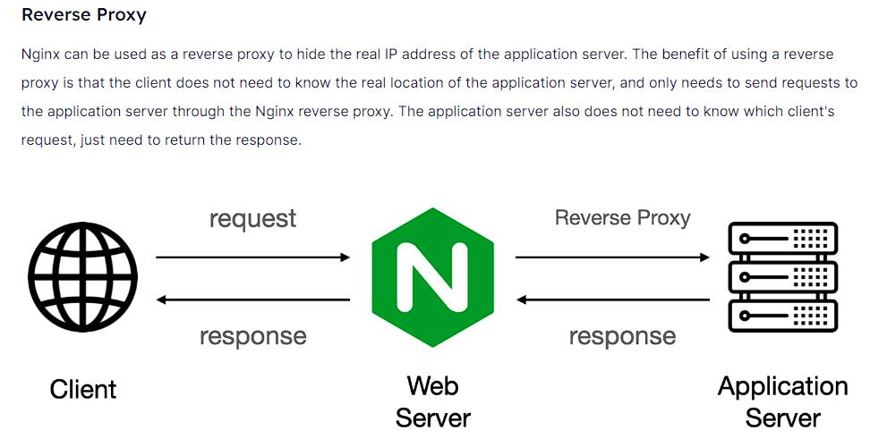
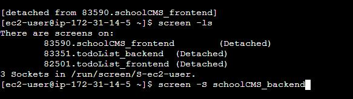
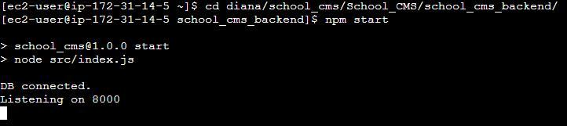
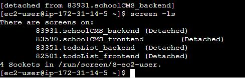

## Fullstack projects
I deployed two fullstack projects (four servers) to AWS, all in one EC2 instance, to save resources.
Introduction
1. school CMS
    - frontend: React
    - backend: NodeJS
2. todo List
    - frontend: HTML+CSS+VanillaJS
    - backend: NodeJS

## Launch a AWS EC2 VM
#### Step 1
Click **launch** button on EC2 Dashboard
#### Step 2
Keep every setting default, except for your instance name and key pair
If you don't have a key pair (you should have one if you use Github),
click **Create new key pair**, I would like to choose .ppk format, since it can be used with Putty
#### Step 3
Click **Launch instance**, then you can see a green success prompt.


## Connect to instance

Click the **connect** button, it goes to the Amazon Linux OS terminal

#### use Putty
Import yourKey.ppk to AWS Key Pairs if you didn't create a new key in `Launch a AWS EC2 VM-step 2`

Then you can use Putty to connect to your ec2 instance to check if its SSH port 22


## Clone github repo
#### Step 1 Install git
```bash
sudo yum update
sudo yum install git
```
#### Step 2 Import Github key to ec2 instance
You have to transfer your github private and public key to your ec2 instance

File transfer btw your local PC to AWS ec2 virtual machine by **WinSCP**

Go to **Advanced** to allow authentication

Then you can transfer files by simply dragging btw the two windows


Drag them to anywhere in your ec2, and use this command to move two files to .ssh folder
```bash
mv id_rsa ~/.ssh
mv id_rsa.pub ~/.ssh
```

Then you should be able to clone your Github repo to your ec2 machine
```bash
mkdir diana
cd diana
git clone ***
```

But another error occurs:

This is because when you transfer a file from outside, the permission of the file is read and write
You have to modify it to read only by
```bash
chmod 600 ~/.ssh/id_rsa
```

Then all clear


## Test the servers
All of my servers are ran with NodeJS. So after `npm i`, I just run `npm start` to start all my servers


## Port forwarding
Before accessing ec2 from public internet, access control has to be correctly configured.
I have 2 projects, 4 servers: 
- school_cms_frontend: localhost:3000
- school_cms_backend： localhost:8000 
- todo_list_frontend：localhost:3001
- todo_list_backend： localhost:8001
In development mode, two frontends are running in port 3000 and 3001, two backends are running in port 8000 and 8001.
In production mode, normally frontend are accessed with HTTP port 80, and user-end should not be able to access the backends directly.

Thus **REVERSE PROXY** and **PORT FORWARDING** are applied here.

#### On one hand, configure Nginx
[confiture nginx](https://hackernoon.com/a-tutorial-to-deploy-the-nodejs-app-to-nginx-server)

1. Install Nginx.
```bash
sudo yum install nginx
or
sudo dnf install nginx
```
2. Reboot the ec2 instance
3. test and start nginx
```bash
sudo systemctl status nginx
sudo systemctl start nginx
```
4. set up Nginx server block
```bash
cd etc/nginx
sudo vim nginx.conf
```

5. Reboot the ec2 instance

Then port forwarding is finished
- school_cms_frontend: localhost:3000 to domain:80
- school_cms_backend： localhost:8000 to domain:81
- todo_list_frontend： localhost:3001 to domain:82
- todo_list_backend：  localhost:8001 to domain:83

#### On the other hand, configure the security group (fire wall)


Both security group and nginx are related to internet safety and access control. 
- Nginx works in HTTP layer. It is responsible for receiving requests from clients and forwarding them to different ports of the serving machine
- Security works in TCP layer. It is responsible for exposing specific ports to outside.  


## Run the servers
#### Run four servers in one terminal
```bsh
(cd school_CMS/frontend; npm start)&(cd school_CMS/backend; npm start)&(cd todo_List/frontend; npm start)&(cd todo_List/backend; npm start)
```
But when you shut your PC down, the ec2 will be disconnected.

#### Run the servers even if you shut your local PC down.
This is realized by using `screen` command
Open a background session and give your session a name
```bash
screen -S shoolCMS_backend
```


Do what you want in one session


Repeat the above steps and then check your session list
```bash
screen -ls
```


All done! 
Hooray!